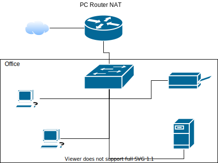

# Zadanie 1

Organizacja planuje ulepszyć działanie istniejącej sieci biurowej.

1. Zaprojektuj oraz udokumentuj konfigurację prototypu rozwiązania z wykorzystaniem oprogramowania ``VirtualBox`` lub podobnego. 

## Schemat

## Wymagania

W sieci pracują komputery biurowe oraz urządzenia siecowe współdzielące zasoby. Do tej pory organizacja borykała się z ręczna konfiguracją urządzeń oraz adresami IP które dla ludzi z poza kadry technicznej były niezrozumiałe. Postanowiono:

* Wykorzystać usługę DHCP do nadawania adresów w sposób automatyczny dla wszystkich stacji roboczych
* Serwer oraz durządzenia IP tj: drukarka muszą posiadać stałe adresy celem zminimalizowanai potrzeby rekonfiguracji ustawiań klientów
* Wprowadzić translację pomiędzy Adresami IP oraz nazwami domenowymi dla kluczowych zasobów
   - erp.mojaorganizacja.pl
   - drukarka.mojaorganizacja.pl
   - router.mojaorganizacja.pl
* Wszystkie urządzenia łączą się z siecią internet z wykorzystaniem bramy NAT
* Wykorzystać podsieć rozmiaru /22 pozwalającej zaadresować co najmniej 600 urządzeń

## Zawartość dokumentacji

# Wersja 1.

 * Charakterystyka rozwiazania 
 * Adresy sieci IP
   - adres sieci: ``149.100.8.0``
   - maska podsieci: ``255.255.252.0``
   - adres rozgłoszeniowy: ``149.100.11.255``
   - max. ilość hostów: 1022
   - adres bramy: ``149.100.8.1``
   - rezerwacja adresu dla drukarki: ``149.100.8.3``
   - rezerwacja adresu dla serwera: ``149.100.8.2``
   
 W związku z powyższym, adresację DHCP rozpoczynamy od adresu ``149.100.8.4``
 
 * Oprogramowanie wykorzystane do realizacji poszczególnych wymagań
   - Cisco Paket Tracer
   
 * Kluczowa konfiguracja oprogramowania pozwalająca na odtworzenie stanu po reinstalacji środowiska
    1. Konfiguracja NAT z iptables 
    2. Konfiguracja DHCP
    
      - statyczne przydzielenie adresu IP serwerowi: ``149.100.8.2``
      - włączenie usługi DHCP oraz wybranie interfejsu sieciowego
      - określenie:
         - adresu bramy, 
         - DNS, 
         - od jakiego adresu IP ma rozpocząć się adresowanie, 
         - maski podsieci, 
         - ilości hostów, które chcemy zaadresować
      - konfiguracja, czyli włączenie adresowania DHCP w urządzeniach, które chcemy zaadresować
      
         
    3. Konfiguracja DNS
    4. Konfiguracja interfejsów sieciowych
    
      - włączenie możliwości adresacji DHCP
      
    5. Inne jeżeli wykorzystane

# Wersja 2.

 * Charakterystyka rozwiazania 
 * Adresy sieci IP
      - adres sieci: ``149.100.8.0``
      - maska podsieci: ``255.255.252.0``
      - adres rozgłoszeniowy: ``149.100.11.255``
      - max. ilość hostów: 1022
      - adres bramy: ``149.100.8.1``
      - rezerwacja adresu dla drukarki: ``149.100.8.3``
      - rezerwacja adresu dla serwera: ``149.100.8.2``
   
 W związku z powyższym, adresację DHCP rozpoczynamy od adresu ``149.100.8.4``
 
 
 * Oprogramowanie wykorzystane do realizacji poszczególnych wymagań
 
 Oracle VM VirtualBox
 
 * Kluczowa konfiguracja oprogramowania pozwalająca na odtworzenie stanu po reinstalacji środowiska
    1. Konfiguracja NAT z iptables 
    2. Konfiguracja DHCP
      - instalacja serweru DHCP: ``apk add dhcp``
      - konfigurujemy nasz serwer: wchodzimy do katalogu ``/etc/dhcp`` i wykonujemy komende ``vi dhcp.config``
      - wpisujemy: ``subnet 149.100.8.0 netmask 255.255.252.0 {``
       (określamy zakres przydzielanych adresów) ``range 149.100.8.4 149.100.11.254;``
       (określamy adres routera) ``option router 149.100.8.1;``
       (określamy DNS-y) ``option domain-name-servers 8.8.8.8, 1.1.1.1;
      ``}``
      
    3. Konfiguracja DNS
    4. Konfiguracja interfejsów sieciowych
    5. Inne jeżeli wykorzystane
