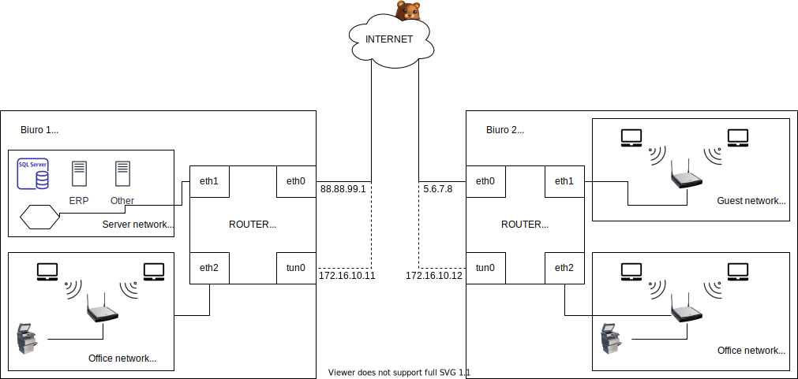
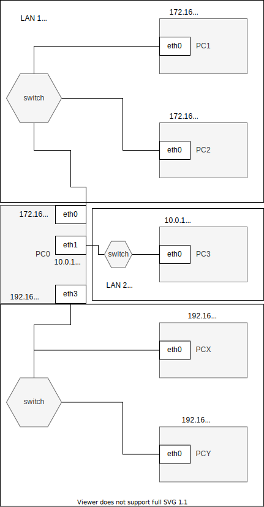

## Konfiguracja route


* routing
    * dodaj trasę default
    * dodaj trasę przez bramę
    * dodaj trasę przez interfejs
    * usuń trasę
    * zmień trasę
    * pobierz trasę dla adresu
     
### ip 
| subcommand    |  polecenie   | opis  |
| ------------- |:-------------| :---------------| 
|   ``route``    |                               | |
|               |   ``ip route add``             | |
| | ``ip route show``| |


### Zastosowania

* Wydzielenie osobnej sieci dla urządzeń sieciowych
* Separacja urządzeń gościnnej sieci WIFI do osobnej sieci
* Zapewnienie komunikacji pomiędzy odrębnymi sieciami lokalnymi z wykorzystaniem VPN



### Zadanie


1.
   * Przygotuj konfigurację sieci zgodnie z powyższym diagramem, 
   
   - najpierw należy stworzyć odpowiednią ilosć maszyn: np. PC0, PC1 i PC3,
   - w globalnych ustawieniach virtual boxa stworzyć dwie nowe sieci LAN1 i LAN2 z adresami jak wyżej,
   - podłączyć maszyy do konretnych sieci; PC1 do LAN1, PC0(ruter) do LAN1 i LAN2, PC3 do LAN2,
   - nadać maszynom ip
   
   * Przetestuj połączenie pomiędzy wszystkimi elementami sieci
   
   - żeby stworzyć połączenia należy określić trasę rutingu, za pomocą ```ip route add```  np.: ```ip route add 10.0.10.0/24 via 172.16.100.1``` albo ``default`` zamisat pierwszego(docelowego) adresu
   -
   * Dlaczego połączenie może nie działać
   
   - domyślne ustawienie o nieprzekazywaniu pakietu dalej, "niemostkowaniu" (?)
   
   JAK TO NAPRAWIĆ --> ``echo 1 > /proc/sys/net/ipv4/ip_forward`` albo ``sysctl net.ipv4.ip_forward=1`` - chodzi o ustawienie flagi która odpowiada za przekazywanie pakietu dalej
   
2. Przygotuj konfigurację tak aby została załadowana poprawnie po ponownym uruchomieniu systemu

`` echo "net.ipv4.ip_forward=1" > /etc/sysctl.d/01--network.conf``

   * Patrz ``utrwalanie statycznej konfiguracji cwiczenia 2``
   * zwróć uwagę na różnice pomiędzy dydtrybucjami systemu
3. Zainstaluj, uruchom i przetestuj działanie aplikacji ``chat``
   * aplikacja dostępna w serwisie github ``https://github.com/jkanclerz/client-server-chat`` lub preinstalowana na maszynie dostępnej w zasobach kursu

### Zadanie do domu

1. Przygotuj konfigurację z zadania 1 wykorzystując inny system operacyjny na komputerze pełniącym rolę routera.
  * debian / centos / inny
  * zapewnij poprawną komunikację pomiędzy PC3 -> PC1
  
2. Dodaj kolejną sieć do komputera pełniącego funkcję routera
   * Sprawdź poprawność komunikacji pomiędzy innymi obszarami sieci
   * Zweryfikuj działanie programu chat pomiędzy różnymi segmentami sieci


