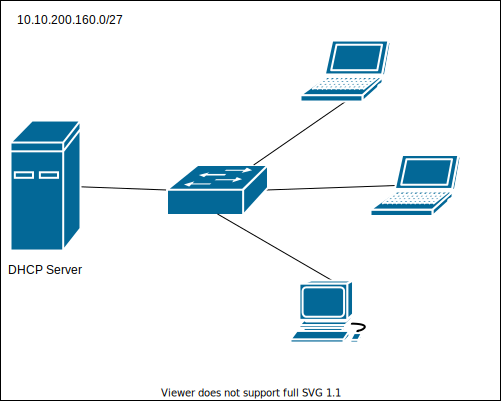

# DHCP - Dynamic Host Configuration Protocol

## Zadanie

1.
   * Przygotuj fizyczną konfigurację sieci zgodnie z powyższym diagramem
   * Skonfiguruj serwer DHCP aby przydzielał pozostałe dostępne adresy w sieci
     * 1 dostępny, adres bramy, 
     * 2 dostępny, adres serewra DHCP
     * pozostałe przydzielane przez DHCP
   * Skonfiguruj klienty do pracy z DHCP
   * Zweryfikuj połączenie pomiedzy maszynami
  
2. 
   * Z wykorzystaniem ``virtualbox`` przygotuj podobną konfigurację gdzie w jednej sieci pracuje komputer pełniący rolę serwera DHCP oraz komputer klienta
   
   Instalowanie dhcp: ``apk add dhcp``
   
   
   * Skonfiguruj serwer DHCP aby przypisywał konfigurację IP zgodnie z obraną adresacją
   
   Tworzymy dhcp.conf i wpisujemy jak w dokumentacji
   ``subnet 10.10.200.160 netmask 255.255.255.224 {``
   ``range 10.10.200.163 10.10.200.190;``
   ``option routers 10.10.200.161;``
   ``option domain-name-servers 8.8.8.8,1.1.1.1;``
   ``}``
   
   Następnie:
   
   ``rc-service dhcpd restart``
   
   
   * Zweryfikuj poprawność przypisywanych parametrów na pozostałych komputerach pracujacych w sieci 

## Parametry konfiguracji DHCP
Jaki parametry konfiguracji można ustawić z wykorzystaniem DHCP

| Parametr                    | 
| -------------                 |
| Adres IP                      |
| Maska podsieci                |
| Brama domyślna |
| Liczba hostów których chemy zaadresować|
| Adres pierwszego hosta |
| DNS|
| |

## Przydatne polecenia

| zachowanie                    | polecenia               | komentarz                |
| -------------                 |:-------------:            | -----:                    |
| porzucanie dzierżawy adresu v1|  |          |
| porzucanie dzierżawy adresu v2|  |          |

## Materiały

* https://kb.isc.org/docs/isc-dhcp-44-manual-pages-dhcpdconf
